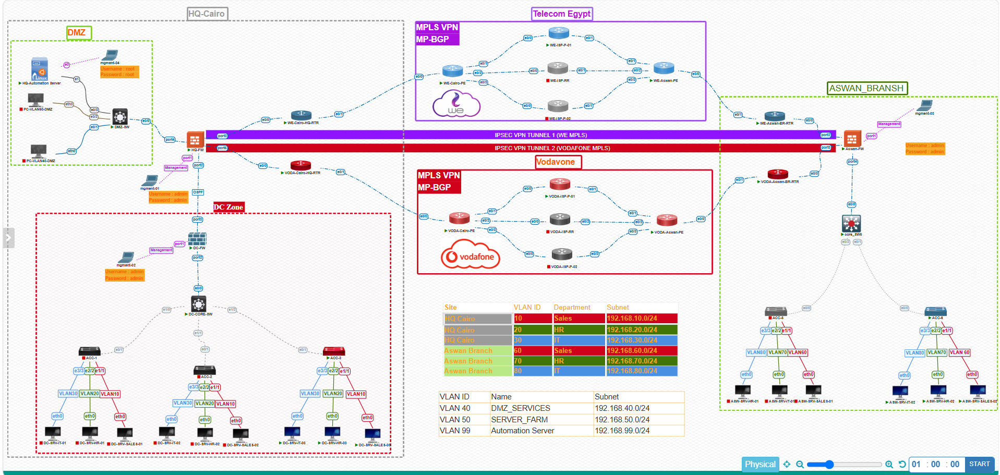

# 🏦 Secure Banking Network Infrastructure

Enterprise Banking Network designed using Cisco and FortiGate technologies.

---

## 📖 Project Overview

This project simulates a secure enterprise banking infrastructure connecting:

- Headquarters (HQ)
- Data Center (DC)
- Disaster Recovery Site (DR)
- Bank Branch

The network is designed with High Availability, Security, Scalability, and Business Continuity.

---

## 🚀 Technologies Used

- Cisco Enterprise Routers
- Cisco Layer 2 Switches
- Cisco Layer 3 Switches
- Cisco Core Switches
- FortiGate NGFW
- OSPF
- BGP
- MPLS
- SD-WAN
- IPsec IKEv2 VPN
- VLANs
- NAT
- ACL
- High Availability

---

## 🔐 Security Features

- Next Generation Firewall
- Site-to-Site VPN
- SD-WAN Failover
- Firewall Policies
- NAT
- VLAN Segmentation
- Access Control
- Secure Inter-site Communication

---

## 🌐 Network Design

The infrastructure includes:

- Headquarters
- Data Center
- Disaster Recovery
- Branch Office
- Dual ISP Connectivity
- Core Layer
- Distribution Layer
- Access Layer

---

## 🛠️ Software

- PNETLab
- Cisco IOS
- FortiOS

---

## 👨‍💻 Author

Islam Ashraf

CCNA Certified

CCNP Enterprise (In Progress)
